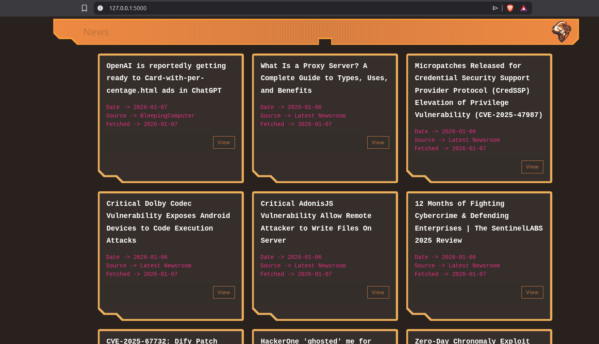
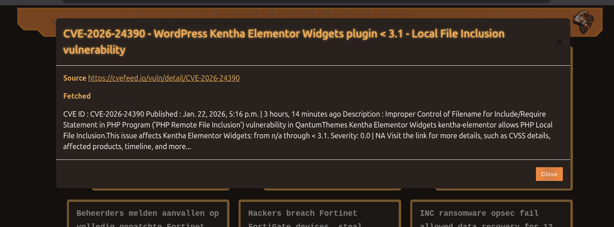

# BeagleWatch
Beagle is watching security news 

News Feed aggregator for cybersecurity articles from The Hacker News, CVE's and other sources.
Makes life easier for security researchers and professionals by collecting relevant news in one place.

Tested on Linux, with docker compose included.

I put the flask app to port 5001 on the host machine.

```commandline
docker compose build
docker compose up -d
```

## The result




